# 대규모 시드 데이터셋(ds_v1_seed0/ds_v2_seed1) 처리 및 거울검출 모델 실험 보고서

작성일: 2026-06-06 · 프로젝트: Find Mirror Geometry Inside FoundationStereo's Prior

---

## 1. 개요

기존 실험(17씬 LOSO, 12씬 범용 head)은 **씬당 1뷰**가 한계였다. 이번에 뷰 다양성을 갖춘
대규모 렌더 데이터셋 2개(seed별 카메라 교란)를 받아 **1,537뷰 전체에 풀 파이프라인**을
돌리고, 거울검출 head 를 **4가지 train/test 체제**로 학습·평가했다.

| 항목 | 내용 |
|---|---|
| 데이터 | `Archive/ds_v1_seed0` (13씬, 836뷰) + `Archive/ds_v2_seed1` (13씬, 833뷰) |
| 뷰 구성 | 씬당 55~66뷰. **v00 = 기준뷰**(교란 0, 두 seed 동일 카메라), v01+ = 랜덤 교란(±0.3 m 이동, ±5° 회전) |
| seed 차이 | 카메라 교란의 난수 시드만 다름 (intrinsic/해상도/스키마 동일) |
| GT | 뷰마다 mirror mask + **GT depth/disparity** + **GT 거울평면**(meta 해석값 + depth 역투영, 교차검증됨) |
| 유효 처리량 | **12씬 × 2seed = 1,537뷰** (loft 제외, §2) — 전 단계 **fail 0** |

파이프라인(뷰당): FS 추론(prior 추출) → RANSAC 평면 → inlier 시각화 → GT 평면 →
AHCF RQ 분석 → 단일뷰 submodel → 범용 head 적용.

---

## 2. 데이터 품질 — loft 렌더 버그 (재렌더 필요)

**loft 씬은 양 seed 모든 뷰에서 R.png가 L.png와 사실상 동일**(평균 픽셀차 0.02,
정상 씬은 8~23). 우측 카메라가 이동하지 않은 렌더 버그로, disparity가 전부 ~0이 되어
분석이 불가능하다. 같은 폴더의 `disp_gt.npy`는 평균 29px로 자기모순 — GT 생성 카메라와
실제 렌더 카메라가 따로 동작했다. **loft는 배치에서 제외했고 재렌더가 필요하다.**

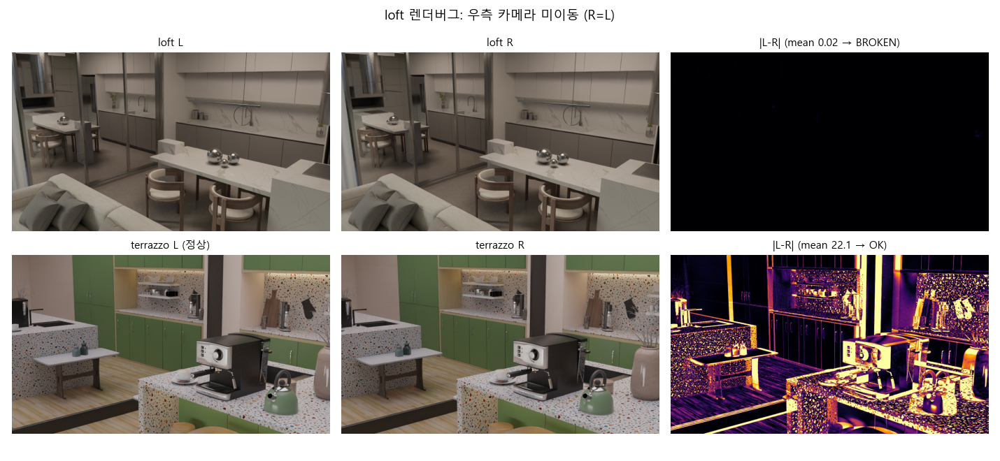

그 외 품질: 빈/이상 마스크 0개 (1,669뷰 전수 스캔). 구버전 데이터셋에서 문제였던
terrazzo/minigym(벽 뒤 거울)·bedroom(마스크 오류)은 이번 판에서 모두 정상.

---

## 3. 처리 인프라 — FS 모델 상주 서버

뷰당 모델 로드(~8s)를 없애기 위해 **FS 모델을 1회 로드해 전 뷰를 연속 추론하는 서버**
(`run_fs_server.py`)와, `fs/.done` 마커를 폴링해 나머지 6단계를 처리하는 **후처리 워커**
(`run_views_batch.py --post_only`)로 분리했다.

| 방식 | 뷰당 시간 | 1,537뷰 예상 |
|---|---|---|
| 기존(뷰마다 7개 subprocess) | ~35 s | ~15 h |
| 워커 4개 + GPU 락 | 실효 ~9 s | ~5.5 h |
| **FS 상주 서버 + 후처리 6~12워커** | **FS 2.7 s + 후처리 병렬** | **~2.5 h (실측)** |

파이프라인 산출물 예시 (computer_room_v00):


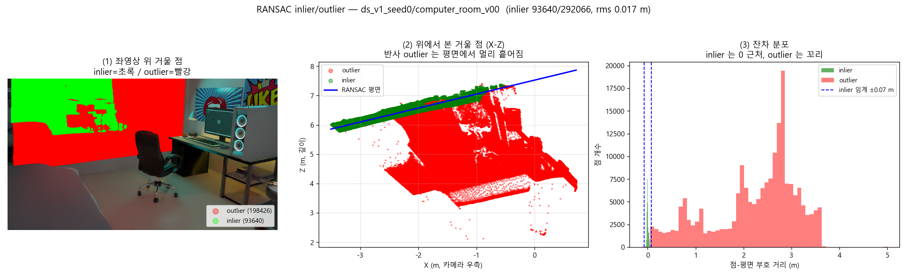

---

## 4. GT 정확도 평가 — "거울이 FS를 깬다" 대규모 정량화 (RQ1)

GT disparity/depth 대비 FS 오차를 거울/비거울 영역으로 나눠 1,537뷰 전체 집계.

| 뷰별 중앙값 | 비거울 | 거울 | 배율 |
|---|---|---|---|
| disp MAE (seed0 / seed1) | 0.21 / 0.22 px | 8.72 / 8.84 px | **~41×** |
| depth MAE (seed0 / seed1) | 0.151 / 0.148 m | 2.57 / 2.61 m | **~17×** |
| bad@1px (픽셀평균) | 8.0% | **96.6%** | — |

두 seed가 사실상 동일한 수치 → 카메라 샘플링에 강건한 결론.
거울 영역의 RANSAC 평면은 여전히 "반사면"(실제 거울면보다 ~2배 깊음, 예: computer_room
6.96 m vs GT 3.24 m)임도 재확인됐다.

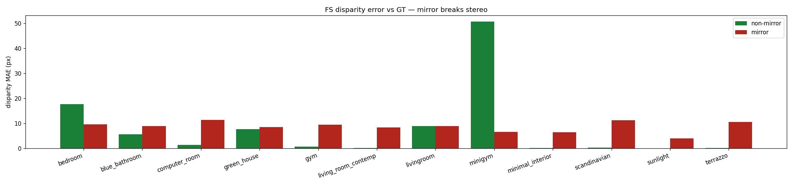
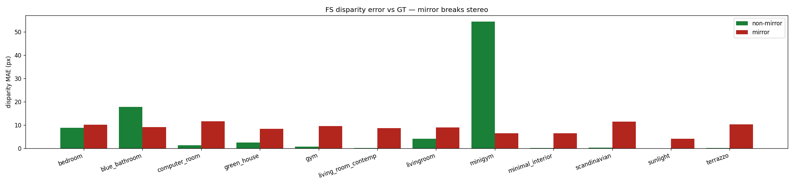

⚠️ 비거울 disp MAE > 5px인 이상 뷰가 seed0 16 / seed1 20개 발견됨(bedroom·blue_bathroom·
green_house 등) — FS 발산인지 데이터 문제인지 미조사.

---

## 5. 거울검출 모델 실험 — 4가지 train/test 체제

공통 셋업: 픽셀당 136-d prior feature(feat_left 128 + cost 통계 8), MLP head(136→64→1),
뷰당 4,000px 균형 샘플, 300 epoch. **모든 모델을 동일한 공통 test 뷰(464개,
view_split의 30%)로 평가**해 직접 비교 가능하다. 산출물: `experiments/_splits/`.

### 5.1 종합 비교

| 모델 | 학습 데이터 | 평가 대상 | AUC | IoU | F1 |
|---|---|---|---|---|---|
| single_scene (own) | 자기 씬 70% (~90뷰) | 자기 씬 30% | **0.985** | **0.715** | — |
| **A. view_split** | 12씬 70% (1,073뷰) | 12씬 30% (unseen 뷰) | 0.958 | 0.546 | 0.692 |
| **②. rep_view** | **씬당 v00 1장 (12뷰)** | 12씬 30% (v00 제외) | 0.955 | 0.540 | 0.686 |
| **B. scene_split** | 8씬 전체 (1,026뷰) | **unseen 4씬** (511뷰) | 0.928 | 0.492 | 0.642 |
| ①. single_scene (cross) | 자기 씬 1개 | 타씬 11개 | 0.908 | 0.425 | — |

**핵심 발견**
1. **씬 특화 프리미엄**: 자기 씬에선 단일씬 모델 IoU 0.715 ≫ 전체모델 0.546.
   검출(AUC)은 일반 feature로 충분하고, **경계 정밀도(IoU)가 씬 특화에서 나온다.**
2. **뷰 다양성은 거의 무가치**: 12장(rep_view) ≈ 1,073장(view_split). 학습량 1/90으로
   동급 — **씬 커버리지가 전부**이고 feature는 시점 불변이다.
3. **씬 일반화의 단계적 손실**: 1씬(0.908) < 8씬(0.928) < 전씬(0.955~0.958, AUC).
4. **"어려운 씬"은 없고 "다른 씬"만 있다**: 전체모델 최약 씬 sunlight(IoU 0.35)·
   minimal_interior(0.36)가 자기 모델로는 0.74 / 0.67.
5. view_split은 train ≈ test (0.957 vs 0.958 AUC) — **과적합 없음**.

### 5.2 A. view_split — 본 씬, 새 시점 (test 464뷰)

씬마다 7:3으로 나누고 12씬의 70%를 **합쳐 단일 모델 1개** 학습.
test AUC 0.958 / IoU 0.546. 씬별 AUC 0.93~0.99.

좋은 예 — blue_bathroom_v51 (IoU 0.82 / AUC 0.99):
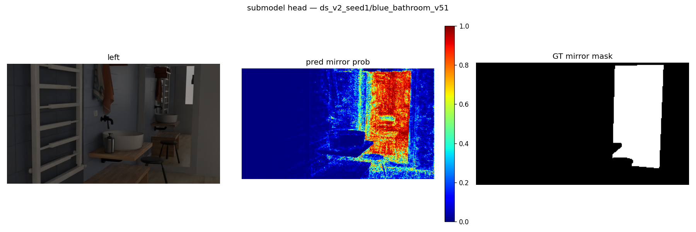

좋은 예 — minigym_v27 (IoU 0.81):
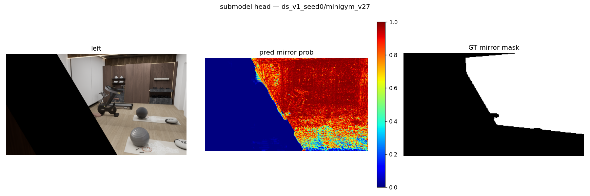

좋은 예 — computer_room_v55 (IoU 0.80):
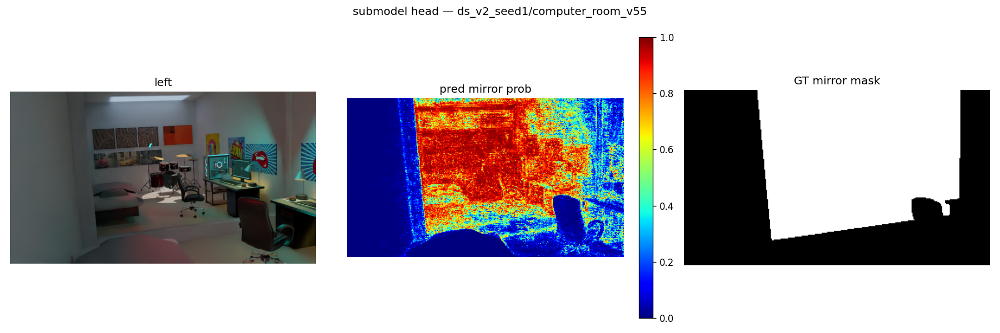

나쁜 예 — minimal_interior_v02 (IoU 0.06, **AUC는 0.96**): 거울이 작고 확률이 0.5 임계
아래로 깔려 IoU가 무너짐 — 순위(검출)는 맞고 캘리브레이션이 문제인 전형 사례.
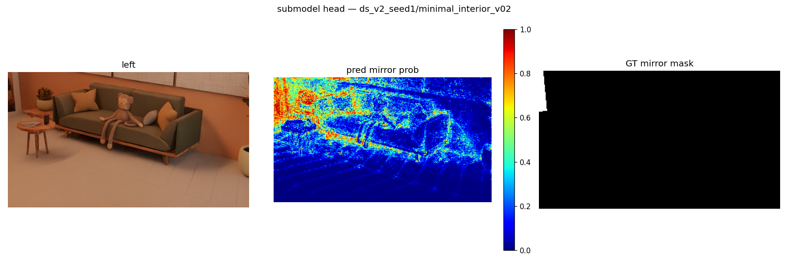

### 5.3 B. scene_split — 한 번도 본 적 없는 씬 (test 4씬 511뷰)

train 8씬 / test 4씬(blue_bathroom·gym·minimal_interior·terrazzo).
test AUC 0.928 / IoU 0.492 (train 0.954/0.557 → unseen 갭 AUC −0.026 / IoU −0.065).

좋은 예 — blue_bathroom_v51 (unseen 씬인데 IoU 0.77):
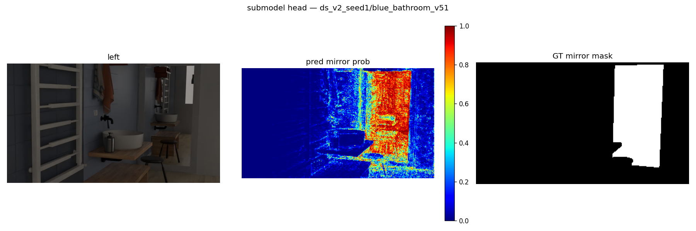

좋은 예 — terrazzo_v29 (IoU 0.68):
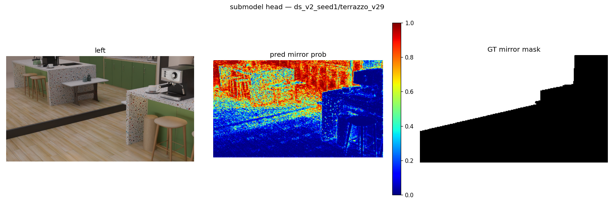

좋은 예 — gym_v60 (IoU 0.66):
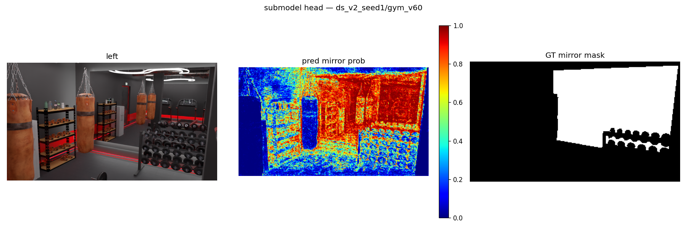

나쁜 예 — minimal_interior_v02 (IoU 0.04): view_split과 같은 뷰가 여기서도 최악 —
이 씬의 도메인 시프트(작은 거울 + 밝은 미니멀 인테리어)가 원인.
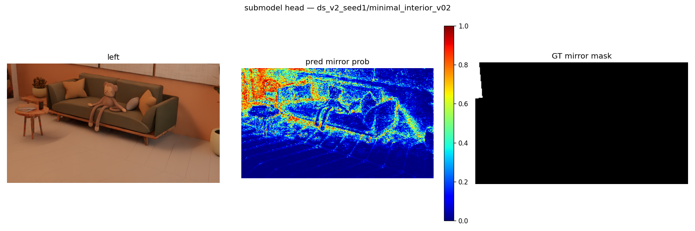

### 5.4 ① single_scene — 씬 1개로 학습한 모델 12개

각 씬의 train 뷰(70%)만으로 학습 → 공통 test 464뷰 평가 → **12×12 매트릭스**
(행=모델, 열=평가 씬, 대각=자기 씬).

own 평균 **AUC 0.985 / IoU 0.715** vs cross 평균 **0.908 / 0.425**.

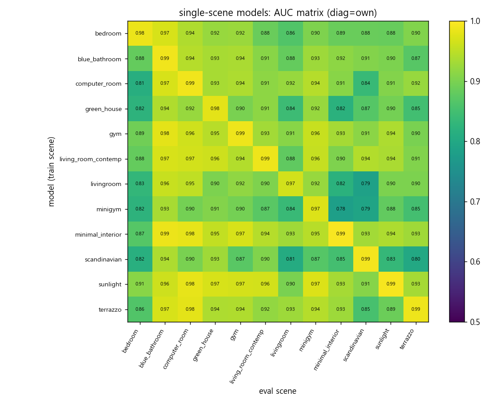
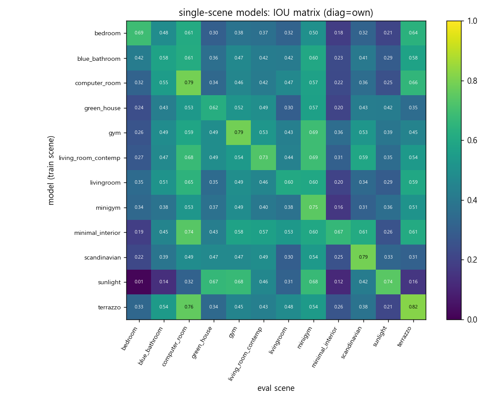

좋은 예 — terrazzo 모델 → terrazzo_v05 (own, **IoU 0.93** = 전 실험 최고):
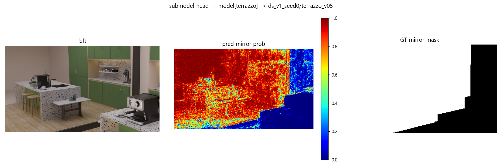

나쁜 예 — minimal_interior 모델 → blue_bathroom_v33 (cross, IoU 0.00):
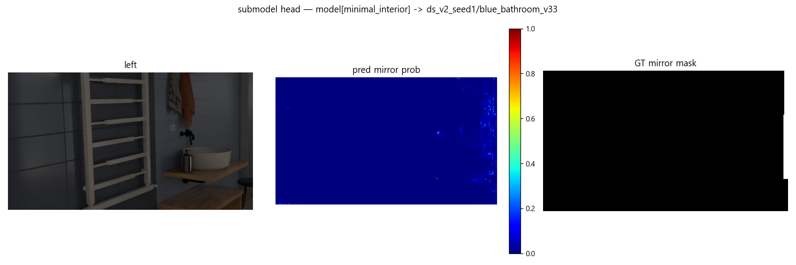

### 5.5 ② rep_view — 씬당 대표뷰 v00 한 장 (12장 학습)

각 씬의 기준뷰 v00(seed0) 12장만, 뷰 전체 픽셀로 학습 → test 459뷰(v00 제외).
**AUC 0.955 / IoU 0.540 — 1,073뷰 학습(view_split)과 사실상 동급.**
train(본 12뷰) IoU 0.628로 test와 차이가 작아 암기가 아닌 일반화임.

좋은 예 — computer_room_v63 (IoU 0.80):
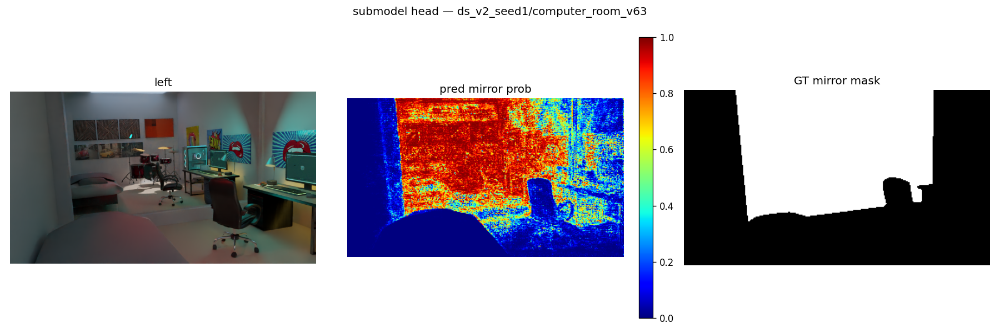

좋은 예 — blue_bathroom_v41 (IoU 0.80 / AUC 0.99):
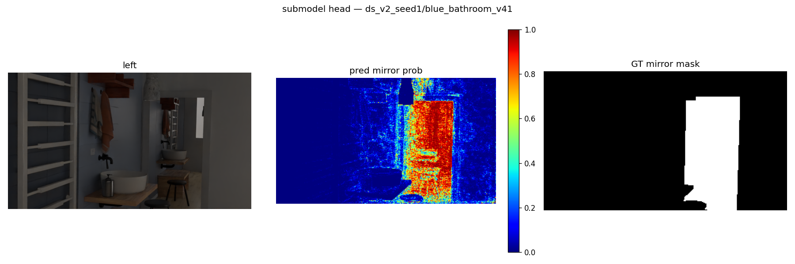

좋은 예 — minigym_v49 (IoU 0.78):
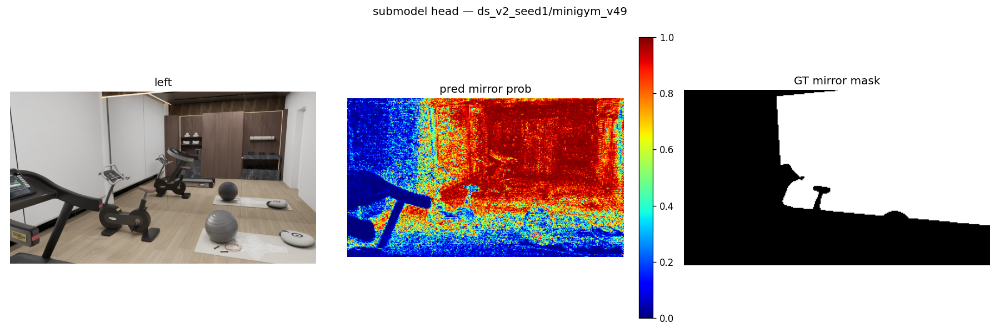

나쁜 예 — blue_bathroom_v03 (IoU 0.05, AUC 0.95): 역시 작은-거울 + 낮은 확률 패턴.
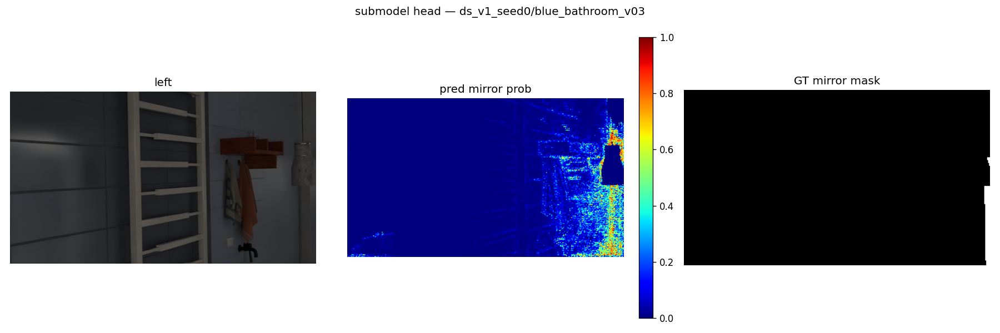

---

## 6. 정공법 — 반사대칭으로 "진짜" 거울평면 복원 (`estimate_mirror_plane_sym.py`)

§4에서 확인했듯 거울 안 점의 RANSAC 평면은 거울면이 아니라 **반사면**(~2배 깊음)이다.
진짜 거울평면 M 은 반사 대칭으로 푼다:

> 거울 안 가상점 P' 는 방의 실제점 P 와 `P = reflect_M(P')` 관계 →
> **대응쌍 (P', Q) 하나의 수직이등분면이 곧 평면 후보**.
> RANSAC: 랜덤 (거울점, 방점) 쌍 → 이등분면 가설 → "P' 반사 후 방 점군과의
> trimmed NN 거리" 스코어(거울은 카메라 뒤도 비추므로 절사 필수) → 상위 가설
> ICP식 정제(반사→NN 대응→닫힌형 재추정). **학습 불필요, FS 출력만 사용.**

검증: 단위테스트 6/6(반사 involution·이등분면 복원·노이즈 2cm+무대응 40% 합성 복원),
파일럿 4뷰에서 법선 0.4~4.7°/perp 0.01~0.40m.

### 6.1 대규모 결과 — 1,536뷰 (GT mask 사용)

| 전체 | 값 |
|---|---|
| 법선각 중앙값 | **2.3°** (<5°: 76%, <10°: 92%) |
| perp 거리오차 중앙값 | **0.14 m** (<0.2m: 57%, <0.5m: 74%) |
| 동시 충족(<10° & <0.5m) | **72%** |

**대표 비교 (computer_room_v00)**: RANSAC 반사면 perp **6.96 m** → 정공법 **3.23 m**
(GT 3.24 m, 법선 2.2°) — 거울 뒤 가상공간이 아니라 거울 유리면 자체를 잡는다.


| 씬 | 각도 med | perp med | 성공률(<10°&<0.5m) |
|---|---|---|---|
| computer_room | 1.4° | 0.04m | **100%** |
| livingroom | 1.0° | 0.05m | 98% |
| minigym | 2.2° | 0.08m | 96% |
| sunlight | 1.1° | 0.13m | 88% |
| gym | 2.3° | 0.07m | 82% |
| minimal_interior | 1.8° | 0.10m | 76% |
| living_room_contemp | 2.2° | 0.16m | 75% |
| blue_bathroom | 0.9° | 0.19m | 74% |
| bedroom | 2.9° | 0.14m | 71% |
| terrazzo | 4.2° | 0.40m | 64% |
| green_house | 5.1° | 0.61m | 40% |
| **scandinavian** | 7.0° | **2.09m** | **2%** |

### 6.2 성공/실패 기하 (top-down 단면)

성공 예 — 반사점(초록)이 방 점군(회색)과 정확히 포개지고 추정 평면(주황)=GT(파랑):


실패 예 — **d-슬라이딩 퇴화** (scandinavian): GT 평면으로 반사하면 점들이 카메라
뒤(관측되지 않은 공간)로 가서 NN 대응이 없음 → 스코어가 신호를 잃고, 보이는 먼 벽에
반사점을 끼워 맞추는 잘못된 평면을 선택:

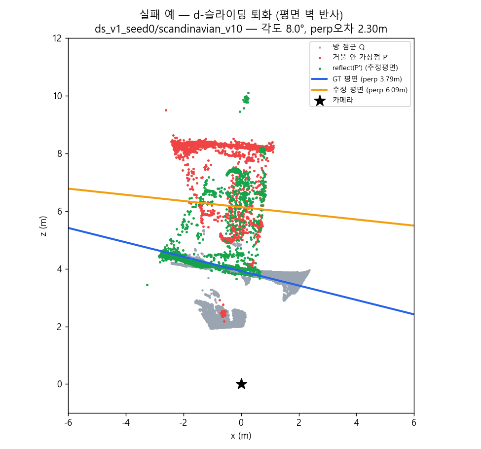

**개선 방향**: ① 거울 mask 경계 링의 3D 점(프레임/벽 = 거울평면 근방 실제 기하)을
"평면이 지나야 하는" 제약으로 추가 → d-슬라이딩 차단, ② 가시성 인지 스코어(반사점이
관측 frustum 밖이면 무벌점), ③ 멀티뷰 일관성.

---

## 7. 한계와 다음 단계

- 정공법은 GT mask 기준 — 다음은 **예측 mask(submodel)로 교체**한 end-to-end 평가
  (`--mask submodel` 옵션 구현돼 있음).
- scandinavian/green_house 형 퇴화는 §6.2 의 경계 링 제약으로 개선 예정.
- 검출 IoU 실패 사례는 대부분 "AUC는 높은데 임계 0.5에서 무너지는" 캘리브레이션 문제 —
  per-scene/적응 임계, 또는 작은 거울 가중 학습으로 개선 여지.
- loft 재렌더 후 재처리 (배치 1줄: `run_fs_server --scenes loft` → post worker).
- 비거울 disp 이상뷰 36개 원인 조사 (FS 발산 vs 데이터).

## 부록 — 산출물 위치

```
experiments/
  ds_v1_seed0/, ds_v2_seed1/      뷰별 전체 산출물 (770 + 767뷰) + _eval_gt_depth.{csv,json,png}
  _splits/view_split/             model.pt, summary.json, applied/{train,test}/(panel·pred_mask·metrics)
  _splits/scene_split/            동일 구성
  _splits/single_scene/           model_<scene>.pt ×12, matrix_{auc,iou}.csv, per_view_metrics.csv
  _splits/rep_view/               model.pt, applied/(train 12 / test 120 샘플 panel)
  <view>/mirror_geometry_sym/     정공법 결과 (result.json: 평면 + GT대비 오차)
  _eval_sym.csv / .json           정공법 전체 집계 (1,536뷰)
scripts/
  run_fs_server.py                FS 모델 상주 일괄 추론
  run_views_batch.py              prepare+파이프라인 배치 (--post_only 폴링 워커)
  train_eval_splits.py            A/B split 실험
  train_eval_extra.py             ①single_scene ②rep_view
  apply_split_model.py            split 모델 → panel/pred_mask/metrics 적용
  estimate_mirror_plane_sym.py    정공법(반사대칭) 평면 추정 (+test_*.py 단위테스트)
  run_sym_batch.py                정공법 샤드 배치 + --aggregate 집계
  build_seeds_report_figs.py      본 보고서 figure 생성기 (+build_sym_report_figs.py)
report/figures_seeds/             본 보고서 이미지 24장
```
