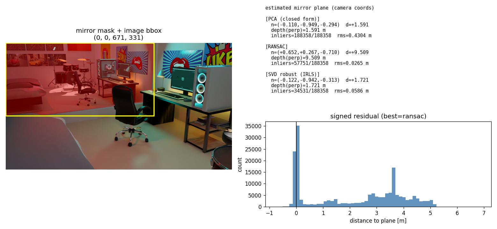

# Finding Mirror Geometry inside FoundationStereo's Prior

스테레오 입력과 사전학습 깊이 prior 만으로 거울을 검출하고 거울 평면 정답(GT)을 구축하기
가반(可搬) 7팀 · 김정현 · 2026학년도 1학기 컴퓨터비전 기술 보고서 (2026-06-05)

> 통합 기술 보고서. 진행/실패 포함 작업 로그는 [worklog.md](worklog.md) 참고.

## Abstract

거울은 좌·우 영상의 광도 일관성(photometric consistency)을 깨뜨려 스테레오 정합을 교란하지만, 바로 그 불안정성이 거울의 위치를 알려주는 신호가 된다. 본 보고서는 사전학습 스테레오 모델 **FoundationStereo**(FS)를 **재학습하지 않고**, FS가 내부적으로 이미 계산한 prior(side-tuning 특징, cost-volume 통계)만으로 거울을 다루는 실험을 정리한다.

1. FS prior 위에 픽셀당 경량 MLP 헤드를 얹어 거울을 **검출** → LOSO(leave-one-scene-out, 12-fold) 평균 ROC AUC **0.911**.
2. FS의 핵심 모듈 **AHCF**(Attentive Hybrid Cost Filtering) 전·후 cost-volume을 같은 분류기로 디코딩 → AHCF **이전** 우연(AUC≈0.51)에서 **이후** 상승(최대 0.80). 거울 신호는 AHCF가 만든다.
3. 거울 점군 RANSAC 평면은 강건(잔차 RMS≈0.03m)하나 거울면이 아니라 **반사면**이다(원리적 한계).
4. 평가용 **거울 평면 GT**를 Blender 원본에서 좌측 카메라 좌표로 추출(16 scene/37 거울). 그 과정에서 데이터셋 가정 초점거리(50mm)가 실제(장면별 25–60mm)와 다른 **스케일 오류**를 발견·교정.

## 1. 서론

거울 표면은 자신의 깊이가 아니라 *반사된 장면*의 깊이를 보여주므로 일반 스테레오·MVS가 거울 너머 가상 공간을 실제 기하로 오인한다. 목표: 거울을 별도 학습하지 않고 FS 내부 표현만으로 (i) 거울 영역 **검출**, (ii) 거울 **평면 기하**(법선·거리·경계) 추정 → MirrorGaussian 등 후속 재구성에 전달. 핵심 가설: **거울이 유발하는 정합 불안정성 자체가 거울의 prior가 된다.**

## 2. 배경: FoundationStereo와 AHCF

추출하는 prior 3종:
- side-tuning 특징 `feat_left`(128채널 2D 특징)
- AHCF 이전 cost volume(`corr_stem` 출력) — 원시 매칭 비용
- AHCF 이후 cost volume(`cost_agg` 출력) — 집계·정제된 매칭 비용

두 cost volume에 동일 분류기를 적용해 disparity 분포의 신뢰도·엔트로피·argmax를 계산, AHCF 전후를 같은 잣대로 비교.

## 3. 방법

### 3.1 데이터셋
MakeStereoDataset로 Blender 17개 실내 장면을 물리 기반 렌더링(베이스라인 0.08m, 1024×576) + 거울 마스크 GT. 거울은 **실제 광선추적 반사**로 렌더 → FS가 거울을 통과해 반사 장면 깊이를 본다.

### 3.2 검출 (접근 #3)
FS 동결, 픽셀당 **136차원**(feat_left 128 + cost 통계 8) 위 작은 MLP(은닉 64)만 학습. 일반화는 **LOSO**로 측정.

### 3.3 AHCF 신호 분석 (RQ)
각 prior 신호를 거울 마스크와 대조해 ROC AUC로 분리도 측정. `pre_*` vs `post_*`/`delta_*` 비교.

### 3.4 거울 평면 적합과 한계
마스크 영역 3D 점에 PCA/RANSAC/IRLS 평면 적합. RANSAC은 강건하나 적합 평면은 **반사면**(거울면=실제점 P와 반사점 P′의 수직이등분면이라 P′만으론 복원 불가).

### 3.5 거울 평면 GT 추출
Blender 거울 메쉬 최소제곱 평면 → 좌측 카메라 OpenCV 좌표 변환. 핵심은 Blender(−Z전방/+Y상)→OpenCV(+Z전방/+Y하) 축 변환:

```
M = F · C⁻¹,  F = diag(1, −1, −1),  n_cam = R·n_world,  d = −n·c
```

검증: GT 평면 모서리를 영상에 재투영해 거울 마스크와 겹치는지 확인.

## 4. 실험 결과

### 4.1 검출 일반화 (LOSO)

| 평가 | AUC | IoU |
|---|---|---|
| 단일 scene (cozy_living_room) | 0.999 | 0.92 |
| 단일 scene (computer_room) | 0.988 | 0.85 |
| **LOSO 평균 (12-fold, 미지 scene)** | **0.911** | **0.454** |
| LOSO 중앙값 | 0.939 | 0.431 |
| 교차-시점 (minigym_view04) | 0.947 | 0.737 |


*그림 1. 경량 헤드 거울 검출(cozy_living_room). 좌:입력 / 중:예측 / 우:GT.*

### 4.2 AHCF가 거울 신호를 만든다

모든 장면에서 AHCF 이전(`pre_*`)은 우연(≈0.51), 이후(`post_*`/`delta_*`)는 상승. 장면별 최고 신호:

| 장면 | PCA rms(m) | RANSAC rms(m) | 최고 AHCF 신호 (AUC) | 검출 AUC/IoU |
|---|---|---|---|---|
| archiviz | 0.427 | **0.047** | delta_conf (0.55) | 0.992/0.85 |
| blue_bathroom | 0.291 | **0.034** | delta_argdisp (0.67) | 0.995/0.87 |
| computer_room | 0.430 | **0.027** | delta_entropy (0.68) | 0.988/0.85 |
| cozy_living_room | 0.804 | **0.040** | post_conf (0.59) | 0.999/0.92 |
| green_house | 0.464 | **0.026** | post_entropy (0.74) | 0.985/0.73 |
| gym | 0.919 | **0.062** | delta_argdisp (0.60) | 0.989/0.85 |
| modern_living_room | 0.124 | **0.040** | feat_left_pc1 (0.80) | — |
| scandinavian | 0.644 | **0.051** | post_entropy (0.75) | 0.996/0.88 |


*그림 2. AHCF 전/후 신호 분석(computer_room). pre(0.51)→post/delta(최대 0.68).*

### 4.3 평면 적합: 강건하지만 "반사면"

RANSAC은 PCA 대비 잔차 RMS를 한 자릿수 낮춘다(예 computer_room 0.43→0.027m). 그러나 적합 평면 깊이는 거울면이 아니라 반사면의 것(perp≈9.5m).


*그림 3. RANSAC 평면(computer_room) — 반사면.*

### 4.4 거울 평면 GT (16 scene / 37 거울)

Blender 원본에서 GT 추출. 거의 완전 평면(planarity RMS≈0), Blender↔데이터셋 카메라 일치(ext_diff≈0). 재투영 overlay가 거울 마스크와 겹침.

| 장면 | 거울 수 | 실제 lens | GT 수직거리(m) |
|---|---|---|---|
| computer_room | 1 | 30mm | 3.24 |
| cozy_living_room | 1 | 26mm | 6.56 |
| archiviz | 2 | 50mm | 6.36 |
| bedroom | 5(옷장 동일평면) | 50mm | 3.64 |
| living_room | 3 | — | 5.75 |


*그림 4. GT 거울 평면(초록) 재투영. computer_room / bedroom(옷장) / living_room.*

## 5. 논의 — 한계와 발견

### 5.1 반사면 ≠ 거울면 (원리적 한계)
거울 안쪽 점군 RANSAC 평면은 반사면. computer_room 반사면 perp≈9.5m vs GT 거울면 3.24m. 거울면 복원은 반사 대칭을 이용하는 정공법 + GT 평가가 필요.

### 5.2 발견: 데이터셋 초점거리 가정 오류
가정 `lens=50mm`이나 실제는 장면별 25–60mm. 가정 fx가 (50/실제)배 과대 → FS 절대 깊이 과대 스케일(computer_room ×1.667). disparity 기반 결론(검출·AHCF)과 GT(절대 미터)는 K 무관. 절대 metric 평가 전 장면별 실제 lens로 K/points 재생성 필요.

### 5.3 마스크/거울 식별 한계
일부 장면은 거울이 카메라 시야 밖(modern_living_room)이거나 벽 뒤/edge-on(terrazzo, minigym), 큐브형(minigym view04)이라 마스크·GT가 비거나 불안정. bedroom·living_room은 올바른 거울 객체로 교정 완료. 상세는 [worklog.md](worklog.md).

## 6. 결론 및 향후 과제

FS prior 만으로 거울 **검출**은 미지 장면·시점에서도 안정적(LOSO 0.911, 교차-시점 0.947)이며 그 신호는 **AHCF** 단계에서 생성됨을 정량 확인. 거울 **평면**은 반사면-거울면 구분이라는 원리적 한계로 점군 적합만으로는 풀 수 없어, 평가용 **GT 인프라**(16 scene)를 구축.

향후: (i) 장면별 실제 초점거리로 K/points 재생성(절대 스케일 교정), (ii) 반사 대칭 정공법 구현 후 본 GT로 법선각도/수직거리/center거리/bbox IoU 평가.

---
References: [1] FoundationStereo (NVlabs, 2024). [2] MirrorGaussian (2024).
코드 `scripts/` · 실험 `experiments/<scene>/` · 설계 `docs/superpowers/`.
