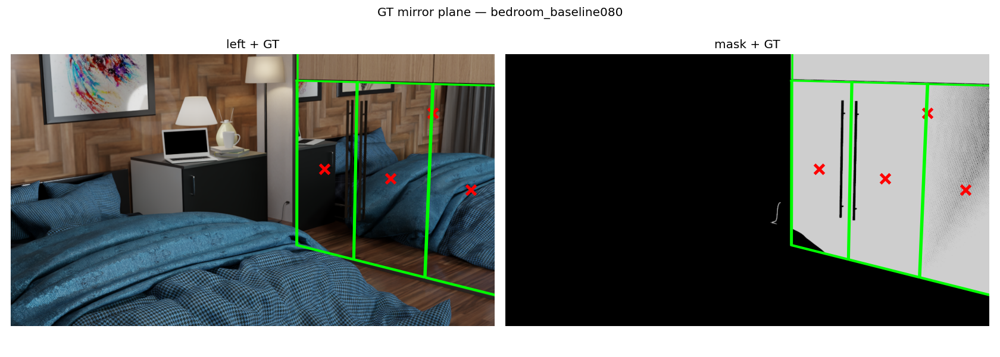
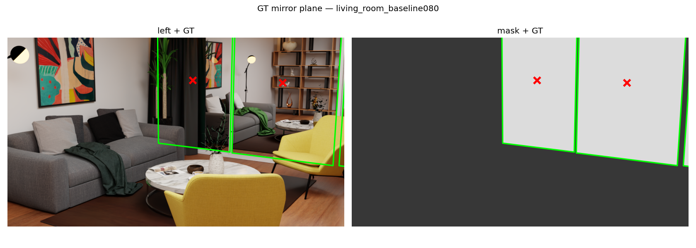

# 작업 로그 — "Find Mirror Geometry inside FoundationStereo's Prior"

2026-06-05 세션 정리 · 성공·한계·실패를 모두 기록 · 가반 7팀(김정현)

## 0. 한눈에 보기 (상태 요약)

| 작업 | 상태 | 핵심 결과 |
|---|---|---|
| 현재 상태 점검 | ✅ 완료 | 코드·실험이 메모리와 일치 확인 |
| GT 거울평면 export 도구 | ✅ 완료 | Blender 추출 + 좌표변환(축플립) 2단계, TDD |
| K(초점거리) 가정 오류 발견 | ⚠️ 중대 발견 | 가정 50mm ≠ 실제 25–60mm(장면별) |
| Mirror GT 전체 생성 | ✅ 완료 | 16 scene / 37 거울, ext 일치 |
| 검출 LOSO / view04 | ✅ 완료 | LOSO AUC 0.911 / view04 0.947 |
| bedroom 마스크·GT 수정 | ✅ 완료 | 옷장 미러도어로 교정(3.6%→31.7%) |
| living_room 마스크·GT 수정 | ✅ 완료 | 거울 발견(MirrorL/M/R) + texture-mirror 가림 우회 |
| terrazzo / minigym 마스크 | ⚠️ 한계 | 거울이 벽 뒤/edge-on — 카메라 시야에 안 보임 |
| modern_living_room 마스크 | ❌ 불가 | 거울이 화면 밖(카메라 이동 필요) |
| view04 GT 생성 | ⚠️ 부분 | 카메라/파이프라인 OK, 거울이 큐브라 평면 GT 불안정 |
| 스크립트 일반화 | ✅ 완료 | prepare_meta 거울/카메라 + scene 오버라이드 |
| 산출물(보고서·노트북·Colab) | ✅ 완료 | `report/`, `.ipynb`, `colab/` |

## 1. GT 거울평면 Export 도구 ✅

정공법(반사 대칭으로 거울면을 찾는 방법) 평가에 필요한 **정답 거울 평면**을 Blender 원본에서 추출하는 도구.
brainstorming → spec → plan → subagent-driven 구현(5 Task, 각 단계 spec/품질 리뷰 통과)으로 제작.

- `MakeStereoDataset/scripts/export_mirror_gt.py` — (Blender) 거울 메쉬 정점 → world 최소제곱 평면 + 실제 카메라 intrinsics.
- `FoundationStereo/scripts/make_mirror_gt.py` — world→left-camera OpenCV 변환(축 플립 `F=diag(1,−1,−1)`) → `gt.json` + 검증 `overlay.png`. 순수 함수는 `test_make_mirror_gt.py`로 TDD(6 테스트).
- 문서: `docs/superpowers/specs/...-design.md`, `docs/superpowers/plans/...-export.md`.

## 2. 중대 발견 — K(초점거리) 가정 오류 ⚠️

GT overlay가 마스크와 안 맞아 디버깅한 결과, 데이터셋이 `lens=50mm`로 **가정**했으나 Blender 실제 값이 장면마다 다름:

| 실제 lens | scene |
|---|---|
| 25–26mm | green_house(25), minigym(25.7), cozy_living_room/livingroom(26) |
| 28–30mm | modern_living_room(28), computer_room/gym/loft/scandinavian(30) |
| 35mm | sunlight |
| 50mm | archiviz, flat-archiviz, terrazzo, bedroom, blue_bathroom |
| 60mm | minimal_interior |

**영향:** `points.npy` depth = fx·baseline/disp 이므로 절대 깊이가 (50/실제)배 어긋남(예: computer_room ×1.667). 단 **disparity 기반 결론(검출·AHCF AUC)과 GT 기하(절대 미터)는 K 무관**. 정공법의 *절대 거리* 평가 전 장면별 실제 lens로 K/points 재생성 필요. GT 도구가 실제 intrinsics를 `gt.json.true_K`·overlay에 사용.

## 3. Mirror GT 전체 생성 ✅

`make_mirror_gt.py --all`로 **16 scene / 37 거울** GT 생성. 모든 scene에서 Blender 카메라와 데이터셋 카메라 일치(ext_diff≈0). 멀티거울: bedroom(옷장)×5, livingroom×6, loft×7, minigym×3, modern×2, sunlight×2, archiviz/flat-archiviz×2, living_room×3.

품질 플래그(평가 시 제외 권장): `blue_bathroom` 프레임 메쉬, `loft/Cube.019`(비평면 0.055).

## 4. 검출 성능 ✅

- 단일 scene: AUC ~0.99 (예 cozy 0.999/IoU 0.92).
- **LOSO(미지 scene, 12-fold): 평균 AUC 0.911 / 중앙값 0.939 / IoU 0.454.**
- **교차-시점(minigym_view04): 12 baseline 학습 → view04 평가 AUC 0.947 / IoU 0.737.**

## 5. 마스크 점검 — 이상 마스크 조사 (혼합 결과)

`render_mask` 자체는 정상(computer_room 재렌더=기존 32.8% 일치)임을 대조로 확인.

### bedroom ✅ 수정 완료
오른쪽에 큰 옷장 미러도어가 보이는데 `find_mirrors`가 이름 우선이라 작은 객체를 골라 마스크 3.6%뿐이었다. 진짜 거울 `Wardrobe_04_001(.001~.004)`로 교정 → 마스크 **31.7%**, GT 재생성(평면 perp 3.64 동일, 범위 정확).

### living_room ✅ 수정 완료
중앙에 거울(`MirrorL/M/R`). 빈 마스크 원인 둘: ① blend 폴더명 불일치(`livingRoom_contemporary`≠`living_room`) 자동 스킵, ② **texture-mirror**(거울 앞 유리/BG 평면)가 정상 render_mask에서 거울을 완전 가림(정상 0%, 가림 제거 32.9%). 가림 제거 마스크 + GT 생성.

### terrazzo / minigym ⚠️ 한계 (재렌더 필요)
대상 거울이 **벽 뒤**(가림 제거 ~52%, 정상 0%)거나 edge-on이라 CM 시야에 거울 표면이 안 보임. 마스크 재렌더로 해결 불가 — 카메라 이동 후 전체 재렌더 필요.

### modern_living_room ❌ 불가
거울(MirrorL/R)이 화면 밖(가림 제거해도 0.2%). 빈 마스크가 기하적으로 정답.

## 6. view04 GT 생성 ⚠️ 부분 성공 / 한계

`minigym.blend` + view04 카메라(prepare_meta)로 GT 경로 구현. 카메라(뷰 시점)·파이프라인 정상(`cam_diff=1.41`=시점차 정상). **그러나 minigym 거울이 평면이 아니라 큐브(`Cube.001~003`)라 평면 GT planarity_rms=1.0m로 신뢰 불가**(메모리 "minigym Cube.xxx"). 큐브의 거울 면만 평면화하는 처리 필요 — 미해결.

## 7. 파이프라인 일반화 ✅

`make_mirror_gt.py`를 view·예외 scene까지 다루도록 일반화:
- 거울 객체: **scene 오버라이드 > `prepare_meta.mirror_objects`(데이터셋 실제 거울) > find_mirrors 자동** → GT와 마스크 거울 일치.
- 변환 카메라: **항상 `prepare_meta.left_camera_to_world`** → baseline·view 모두 정확. blend CM과 차이는 정보용(`blend_vs_dataset_cam_diff`).
- blend 경로 오버라이드: living_room→`livingRoom_contemporary/living_room.blend`, minigym_view04→`minigym.blend`.
- bedroom→옷장 거울 오버라이드.

## 8. 산출물 ✅

- **통합 보고서**: `report/index.html` (+ `index.md`) — 기술 결과.
- **작업 로그**: `report/worklog.html` (+ `worklog.md`) — 본 문서.
- **그림**: `report/figures/`.
- **로컬 재현 노트북**: `mirror_pipeline_demo.ipynb`.
- **Colab**: `colab/mirror_pipeline_colab.ipynb` + `colab_bundle.zip` + `colab_model_vitl.zip`(ViT-L 슬림 1.4GB).
- scene 보고서 예: `experiments/minigym_view04/report.html`.

## 9. 다음 과제

- 장면별 실제 lens로 **K/points 재생성**(절대 스케일 교정) — 정공법 metric 평가 선행.
- **정공법**(반사 대칭 M 최적화) 구현 → 본 GT로 법선각도/수직거리/center거리/bbox IoU 평가.
- minigym 큐브 거울 면-단위 평면 추출, terrazzo/minigym/modern 카메라 재배치 재렌더(선택).
