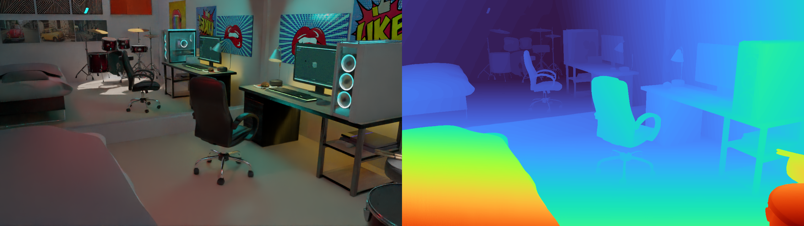
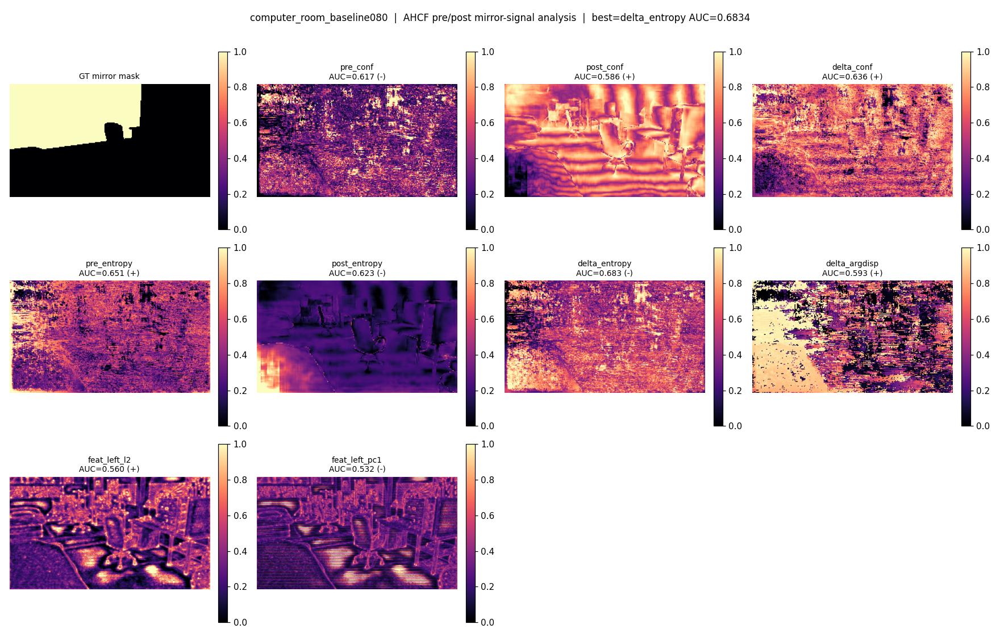
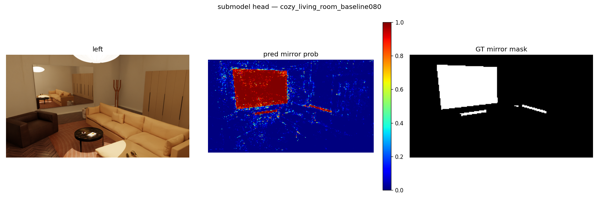
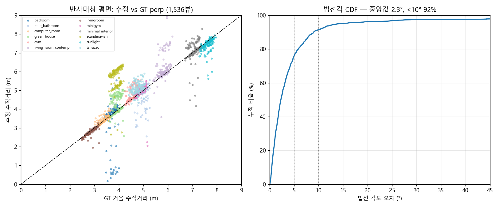
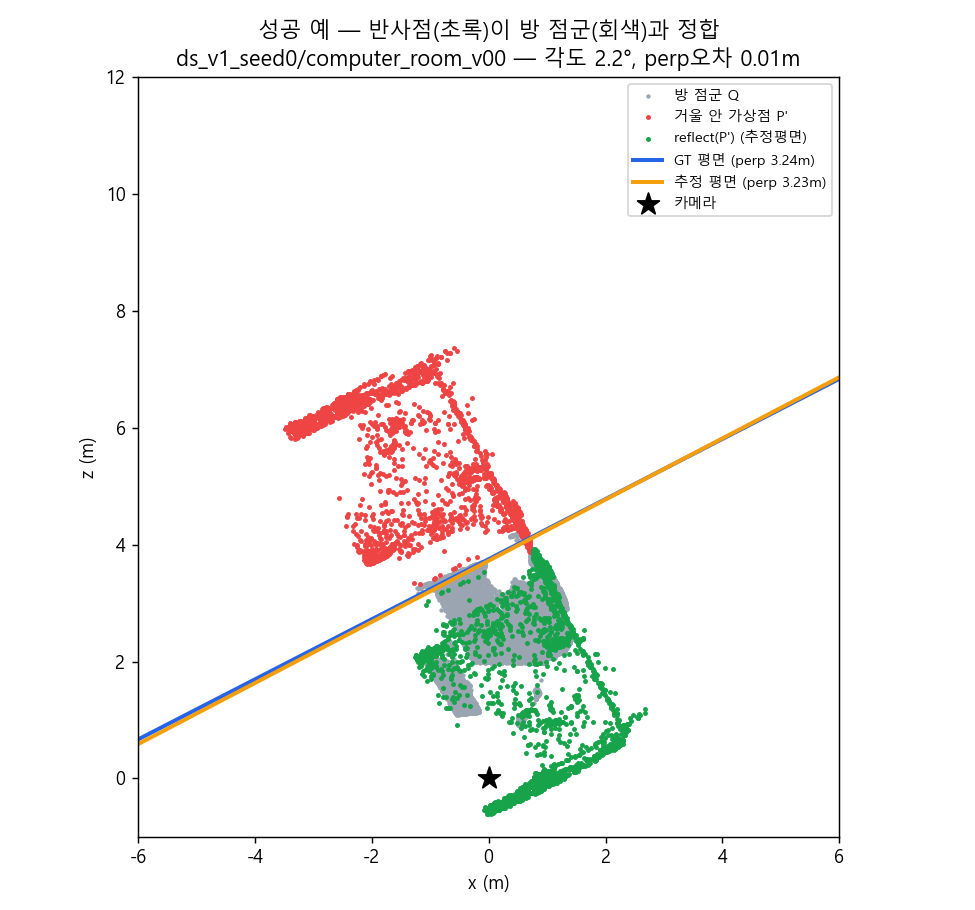
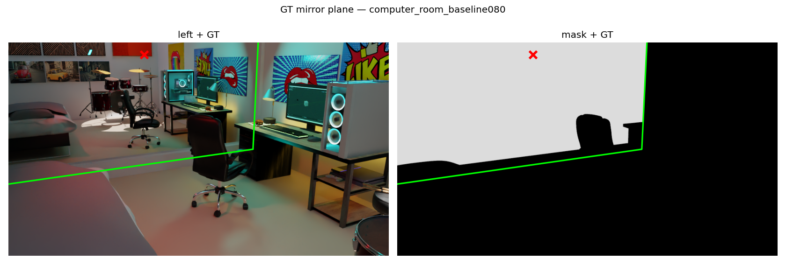

# Find Mirror Geometry Inside FoundationStereo's Prior

스테레오 Prior에 내재된 거울 기하의 복원 — 가반 7팀, 김정현 (20211680)
컴퓨터비전 프로젝트 (2026-1학기). IPIU 2026 투고.

스테레오 입력 한 쌍만으로, **사전학습된 [FoundationStereo](https://github.com/NVlabs/FoundationStereo)의
prior(disparity·confidence·entropy·내부 feature)만을 사용**해 장면 속 **거울의 기하**
(거울 영역 검출 mask·bounding box, 그리고 거울 **평면**의 법선/거리)를 복원할 수 있는지 연구한다.
별도 거울 전용 학습 없이, 범용 스테레오 모델이 거울 앞에서 "무엇을 알고 있는지"를 캐낸다.

> **이 저장소는 정리된 결과물 보관본입니다.** 무거운 재생성 가능 산출물(FS 추론 텐서,
> 렌더 데이터셋, pretrained 가중치)은 제외했고, **코드·전체 수치 결과(result JSON/CSV)·
> 학습된 모델(.pt)·논문·보고서·발표자료·재현 노트북**만 담았습니다. 재생성 방법은
> [`REPRODUCE.md`](REPRODUCE.md) 참고.

### 📄 최종 보고서 (메인 제출물)

**[Find_Mirror_Geometry_최종보고서_20211680_김정현.pdf](Find_Mirror_Geometry_최종보고서_20211680_김정현.pdf)** — 최종 제출 보고서.

함께 보기: [발표 슬라이드](FoundationStereo/presentation/slides.html) · [기술보고서(seed 데이터셋)](FoundationStereo/report/ds_seeds_report.html) · [논문 수치 검증](FoundationStereo/report/paper_results.html) · [논문 LaTeX](FoundationStereo/paper/paper_final.tex)

---

## 핵심 결과

| 질문 | 결과 (1537뷰 = 12씬 × 2 seed 집계) |
|---|---|
| **RQ1. 스테레오는 거울에서 깨지는가?** | 비거울 disparity MAE **0.21px** vs 거울 **8.7px (×41)**; depth 0.15m vs 2.6m (×17); bad@1px 2.6% vs **98.4%**. → FS는 거울을 통과해 "반사된 장면"의 깊이를 본다. |
| **RQ2. 그 실패가 prior에 신호로 남는가?** | AHCF(반복 정제) 이후 단일 채널 AUC 상승(post_entropy 0.587 vs pre 0.545). 단일 채널은 약하지만, **학습된 136차원 조합 → AUC 0.93~0.96**. AHCF가 거울 신호를 만든다. |
| **거울 검출 (작은 MLP head, 픽셀당 136d)** | view-split AUC **0.958** / IoU 0.546; scene-split(unseen) AUC **0.928** / IoU 0.492; 단일씬 own AUC 0.985 / IoU 0.715. **대표뷰(v00) 1장만 학습해도 0.955** → 시점 다양성 불필요, 씬 커버리지가 전부. |
| **거울 평면 복원 (반사대칭 정공법)** | (거울안 점 p′, 방 점 q) 수직이등분면 RANSAC + ICP. 법선각 med **2.30°**, 수직거리오차 med **0.137m**, 동시성공(<10°&<0.5m) **71.7%**. naive RANSAC(반사면을 거울면으로 오인) 87.5°/2.52m/0.1% 대비 압도. |

GT 거울평면: 16씬 / 37거울을 Blender에서 추출(절대 미터, K 무관).

## 결과 이미지

**RQ1 — 스테레오는 거울에서 깨진다.** FoundationStereo가 거울을 통과해 "반사된 장면"의 깊이를 보면서 거울 영역 disparity가 크게 어긋난다(computer_room).



**RQ2 — 그 실패가 prior에 신호로 남는다.** AHCF(반복 정제) 전/후 confidence·entropy 신호 분석. 정제 후 거울 영역이 분리되기 시작한다(단일 채널은 약하나, 학습된 136차원 조합이 강하게 분리).



**거울 검출 (픽셀당 136d 경량 MLP head).** 좌: 입력 / 중: 예측 / 우: GT (cozy_living_room).



**거울 평면 복원 (반사대칭 정공법).** 좌: 추정 vs GT 법선각·수직거리 산점도 + CDF / 우: 성공 예 top-down(추정 평면이 GT 거울 유리면과 일치).




**GT 거울평면 재투영 오버레이** (computer_room) — Blender에서 추출한 GT 평면을 카메라로 재투영해 마스크와 정합 확인.



> 더 많은 그림: [`FoundationStereo/report/figures/`](FoundationStereo/report/figures) · [`figures_seeds/`](FoundationStereo/report/figures_seeds)

## 파이프라인

```
스테레오 L/R
  └─ FoundationStereo 추론  → depth / disparity / confidence / entropy / 내부 feature (136d)
       ├─ AHCF 전후 feature 분석            (analyze_features.py)        … RQ2
       ├─ 픽셀당 136d MLP head → 거울 mask   (submodel_head.py)           … 검출
       └─ 거울 영역 3D 점 → 반사대칭 평면추정 (estimate_mirror_plane_sym.py) … 거울 평면
  └─ GT 평면(Blender export)으로 정량 평가   (make_mirror_gt.py / eval_*)
```

## 저장소 구성

```
FoundationStereo/
  scripts/            모든 파이프라인 코드 (추론·검출·평면추정·평가·split 학습)
  paper/              논문 (paper_final.tex/md, ipiu_draft.tex, sections, reviews)
  report/             기술보고서·작업로그·논문수치 (md+html), figures/ figures_seeds/
  presentation/       발표 슬라이드 (slides.html) + figures
  colab/              재현 노트북 (.ipynb) + 빌드 스크립트  (※ 대용량 ckpt zip 제외)
  docs/               설계 spec / plan
  experiments/        ★ 전체 수치 결과만: 뷰별 result.json·metrics·gt.json,
                        학습모델 _model/_splits/_loso (.pt), 집계 CSV/JSON
                        (재생성 가능한 .npy/.npz/.ply/.png 텐서·이미지는 제외)
  *.ipynb, build_*.py, requirements.txt, setup_local.ps1
MakeStereoDataset/
  scripts/            데이터셋 생성·거울GT export·마스크 재렌더 코드
REPRODUCE.md          전체 재생성 절차
```

## 외부 의존물 (이 저장소에 없음 — 재취득)

| 항목 | 출처 |
|---|---|
| **FoundationStereo 코드·pretrained** | https://github.com/NVlabs/FoundationStereo (clone → `FoundationStereo/repo`; pretrained 23-51-11=ViT-L, 11-33-40=ViT-S는 해당 repo의 다운로드 안내) |
| **테스트 데이터셋 (렌더 아카이브)** | Google Drive: https://drive.google.com/drive/folders/1nLNR5I0sW88uuq7VjEfwBzC2EQtZPVP5 (※ 휘발될 수 있음) |
| **.blend 소스 씬 (reflect3r)** | HuggingFace: https://huggingface.co/datasets/jinggogogo/reflect3r_synthetic_data/tree/main/blender_source_files |

## 환경

- Python 3.12, **PyTorch 2.7.1 + cu128** (GPU = RTX 5070 Ti, Blackwell sm_120 → repo 기본 cu121 torch는 비호환)
- flash-attn 불필요(코드 미사용), xformers 선택. 자세한 셋업: `FoundationStereo/setup_local.ps1`, `FoundationStereo/README_local.md`
- Windows. 자세한 실험 로그: `FoundationStereo/EXPERIMENTS.md`, `FoundationStereo/report/`
